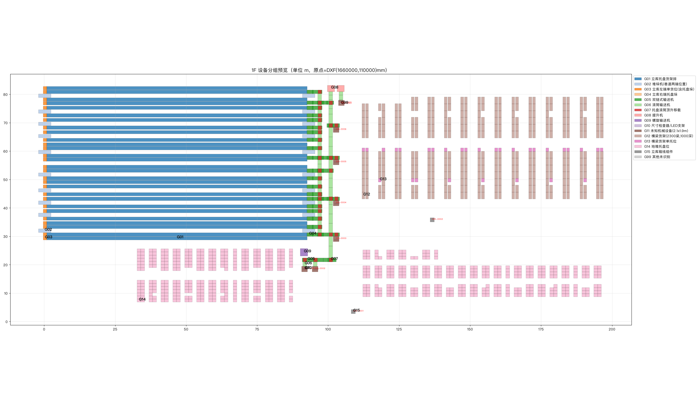

# DXF to Blender Warehouse Layout

Turn warehouse and production-line DXF drawings into editable Blender scenes with an AI agent, a reusable layout skill, a companion Blender extension, and your own equipment assets.

The workflow combines AI-assisted drawing interpretation with user review and scripted scene generation. Repeated equipment is organized into editable Geometry Nodes arrays, with a DXF underlay for visual comparison.



*Example review output: grouped equipment footprints and numbered items for confirmation before modeling.*

## How the pieces fit together

| Component | Role | Included? |
| --- | --- | --- |
| **`dxf-blender-layout` skill** | Guides drawing analysis, asset matching, user confirmation, generation, and validation. Includes reference guides and Python helpers. | Yes |
| **Warehouse Layout extension v0.3.0** | Runs Blender operations: Geometry Nodes arrays, height alignment, DXF underlays, wall generation, and validation reports. | Yes, as an installable ZIP |
| **Blender MCP bridge** | Connects the AI client to Blender so it can inspect the scene and execute Blender Python. | No; install and configure separately |
| **Equipment asset library** | Supplies the rack, conveyor, pallet, robot, and other equipment models used in the scene. | No; provide your own `.blend` file |

```text
DXF drawing + equipment asset library
                  |
        AI agent + layout skill
                  |
       Equipment list + numbered preview
                  |
             User confirmation
                  |
        Blender MCP → Warehouse Layout extension
                  |
       Editable scene + comparison + validation
```

## Features

- **Drawing analysis:** inspect layers, blocks, annotations, anonymous dynamic blocks, and candidate floor-plan regions.
- **Review before generation:** produce a CSV equipment list, numbered preview, and questions about uncertain items before changing the scene.
- **Linked equipment assets:** reference collections from your `.blend` library.
- **Editable repetition:** use XYZ arrays for regular rack rows and pallet grids, and point-based instancing for mixed conveyor equipment and irregular placements.
- **Drawing comparison:** import a layer-organized DXF underlay and switch to a top-down comparison view.
- **Wall generation:** derive wall and column geometry from configured drawing layers, with adjustable heights.
- **Validation:** count equipment and check supported relationships between racks, hoists, stacker cranes, rails, and guards.

## Requirements

- **Blender 4.2 or newer**, as declared by the extension manifest. The skill's Geometry Nodes helper scripts have been validated in Blender 4.4.
- **An AI agent** that can read the skill and its reference files, run local Python scripts, and access Blender through an appropriate tool connection.
- **A working Blender tool connection**, such as Blender MCP, that supports scene inspection and Blender Python execution.
- **Python 3**, with `ezdxf` and `matplotlib` for drawing analysis outside Blender.
- **A DXF drawing** and **an equipment asset library** containing asset-marked collections.

The extension bundles `ezdxf` and supporting wheels for use inside Blender. The external analysis environment is installed separately.

> **Language:** this README is in English. The current skill, detailed guides, Blender panel labels, and review CSV schema are primarily in Chinese. English prompts can be used, but the package is not fully localized.

## Installation

### 1. Install the skill

Download or clone this repository. The skill is a folder containing `SKILL.md`, reference guides, scripts, and a configuration template. Keep the entire `dxf-blender-layout/` folder together so relative paths continue to work.

- **If your agent supports folder-based skills:** install the folder using that agent's documented skill installation method. Skill directories and discovery rules vary by client.
- **If your agent does not discover skills automatically:** give it access to the repository and explicitly ask it to read `dxf-blender-layout/SKILL.md`, follow its workflow, and load the referenced files as needed. This requires local file and script access; pasting the prompt into a chat-only interface is not sufficient.

For example, a Claude Code installation can use the following commands from the repository root:

```bash
mkdir -p ~/.claude/skills
cp -R dxf-blender-layout ~/.claude/skills/
```

That path is specific to Claude Code, not a universal agent setting. If you already have this skill installed, back up any local customizations before replacing it.

The workflow is not tied to a particular agent, but compatibility depends on the client's file access, Python execution, and Blender tools. This repository does not claim verified support for every agent.

### 2. Install the Blender extension

1. Download [`warehouse_layout-0.3.0.zip`](warehouse_layout-0.3.0.zip). Keep it zipped.
2. In Blender, open **Edit → Preferences → Get Extensions → menu → Install from Disk**.
3. Select the ZIP and enable the extension.
4. In the 3D Viewport, press **N** and look for the **仓储布局** (Warehouse Layout) tab.
5. In the extension preferences, set the path to your equipment asset library.

Asset classification uses configurable name keywords. The defaults match Chinese names such as `货架` (rack), `提升机` (hoist), and `护栏` (guard). If your asset names are in English, adjust the **类型规则** (type rules) preference to match your naming convention.

### 3. Connect Blender MCP

Install and configure your chosen Blender MCP bridge using its own instructions, connect it to your AI agent using the client’s MCP configuration, and start its service in Blender.

Before starting a project, ask the AI to inspect the current Blender scene. Proceed once it can access the scene and execute Blender Python. The Warehouse Layout ZIP is a Blender extension; it does not install or configure an MCP server. If your agent uses another Blender Python execution bridge, the extension operators can also be called through that bridge; adapt the connection setup to your client.

### 4. Set up drawing-analysis dependencies

From the repository root, create a separate Python environment:

```bash
python3 -m venv .venv
source .venv/bin/activate
python -m pip install ezdxf matplotlib
```

On Windows PowerShell, activate it with `.venv\Scripts\Activate.ps1` instead. Tell the AI which Python environment to use for the analysis scripts.

## Quick start

Prepare:

- A DXF floor plan. Export DWG files to DXF first and bind external references if their geometry is needed.
- A `.blend` equipment library with asset-marked collections and recognizable equipment names.
- An output directory.
- Any known rack heights, storage levels, equipment specifications, and wall heights. A reference top view or render is also useful.

Open a new Blender scene, start your Blender tool connection, and send this prompt to your AI agent, replacing the example paths:

```text
Read /path/to/dxf-blender-layout/SKILL.md and follow the dxf-blender-layout
workflow to reconstruct this warehouse layout in Blender. Load its referenced
guides and use its bundled scripts as needed.

DXF: /path/to/warehouse.dxf
Asset library: /path/to/equipment-library.blend
Output directory: /path/to/project/output/
Target: first-floor equipment, including the full height of racks that span floors.

Start with drawing analysis. Produce the equipment CSV, numbered preview,
interpretation summary, project-config.json, and placements.json.
Ask me to confirm uncertain equipment mappings and missing height parameters
before generating the Blender scene.

After confirmation, link assets from my library, use editable Geometry Nodes
for repeated equipment, import the DXF underlay, and validate the result.
Use English for explanations, while retaining the skill's required filenames
and CSV column names.
```

Add confirmed dimensions or a reference image path to the prompt when available. The workflow should ask about missing heights rather than infer them from a floor plan.

## Review and generation workflow

1. **Analyze the drawing.** Identify the main plan, equipment groups, coordinates, units, and content to exclude.
2. **Review the interpretation.** Check the equipment CSV and numbered preview. Confirm mappings, exclusions, and missing dimensions in chat or in the CSV.
3. **Generate the scene.** Link approved assets and build arrays or point instances. Unconfirmed items remain pending.
4. **Compare and validate.** Check the scene against the DXF underlay, inspect counts and geometry, and review the validation report.
5. **Refine and deliver.** Adjust exposed node parameters and save the scene, configuration, equipment list, and comparison outputs.

The initial analysis stage produces the following files and does not generate a `.blend` scene. Folder names use English. The Chinese filenames below remain part of the current skill's output convention:

```text
output/review/
├── 1F设备清单.csv          # Equipment list and user confirmation columns
├── 1F编号预览.png          # Numbered layout preview
├── 1F识图摘要.md           # Interpretation summary and questions
├── 1F待确认局部.png        # Optional close-ups of uncertain items
├── project-config.json    # Project settings
├── placements.json        # Placement data
└── _intermediate/                 # Intermediate analysis files
```

The default scope is first-floor equipment, while preserving the full confirmed height of racks that span floors. Specify a different scope in your prompt when needed. Building floors and rack storage levels are tracked separately.

## Blender Python interface

With the extension enabled, its operators can be called from Blender's Python Console or through an MCP tool that executes Blender Python:

```python
import bpy

# Create the reusable Geometry Nodes groups.
bpy.ops.wh.setup_nodes()

# Import an underlay using a completed project configuration.
bpy.ops.wh.import_underlay(config_path="/absolute/path/to/project-config.json")

# Toggle the top-down comparison view.
bpy.ops.wh.compare_mode()

# Run the extension's validation and read its report.
bpy.ops.wh.validate()
print(bpy.context.scene.get("wh_last_report", ""))
```

Additional operators include `wh.to_xyz`, `wh.to_points`, `wh.align_heights`, and `wh.build_walls`. Their use depends on the existing scene and confirmed project parameters; see the skill and the README inside the extension ZIP for details.

## Repository contents

| Path | Contents |
| --- | --- |
| [`dxf-blender-layout/SKILL.md`](dxf-blender-layout/SKILL.md) | Skill instructions and workflow constraints |
| [`dxf-blender-layout/references/`](dxf-blender-layout/references/) | Drawing interpretation, asset matching, confirmation, generation, and validation guides |
| [`dxf-blender-layout/scripts/`](dxf-blender-layout/scripts/) | DXF inspection, preview rendering, layout math, and Geometry Nodes helpers |
| [`dxf-blender-layout/assets/project-config.json`](dxf-blender-layout/assets/project-config.json) | Starting template for project settings |
| [`warehouse_layout-0.3.0.zip`](warehouse_layout-0.3.0.zip) | Installable extension, including Python source and bundled dependencies |
| [Workflow guide](新图纸建模_SOP.md) | Detailed operating procedure in Chinese |
| [Product specification](仓储布局工具_PRD.md) | Extension requirements and design notes in Chinese |
| [Example preview](examples/编号预览_示例.png) | Sample output from the confirmation stage |

## Current limitations

- Equipment interpretation requires review. The analysis scripts extract drawing data; they do not independently determine what every symbol represents.
- The repository includes a preview image, but no sample DXF or equipment `.blend` library for an end-to-end demo.
- Asset dimensions, origins, and naming affect placement and classification. Linked scenes continue to depend on the source asset library.
- The DXF underlay is intended for viewport comparison; additional setup is needed to render its lines.
- Wall generation simplifies architectural geometry. The bundled extension currently treats window segments as full-height walls.
- The extension's rule checks cover specific warehouse relationships. Visual comparison and project-specific checks remain part of acceptance.

## License

The Blender extension manifest declares **GPL-3.0-or-later**. This repository does not yet include a root license file specifying terms for the skill, documentation, and other standalone files. Bundled third-party dependencies retain their respective licenses.
